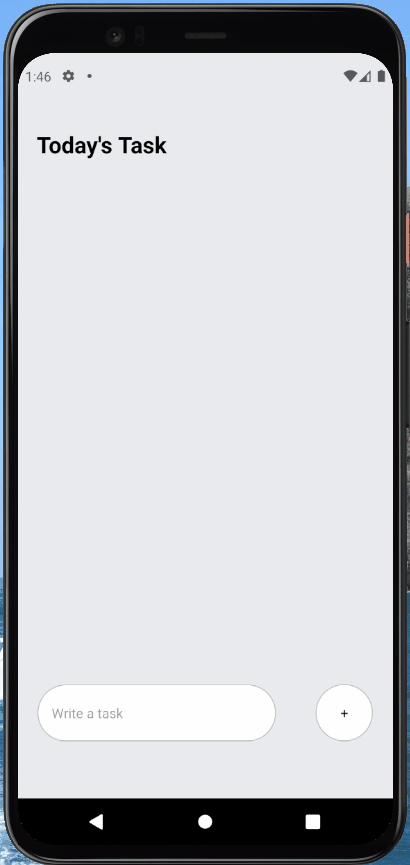

# react-native-todoList
Sample React Native Todo List application, You can just add the task.

# Run the application
npm start

# Run in Android 
npm run android

# Run in IOS 
npm run ios

# Run in WEB 
npm run web

